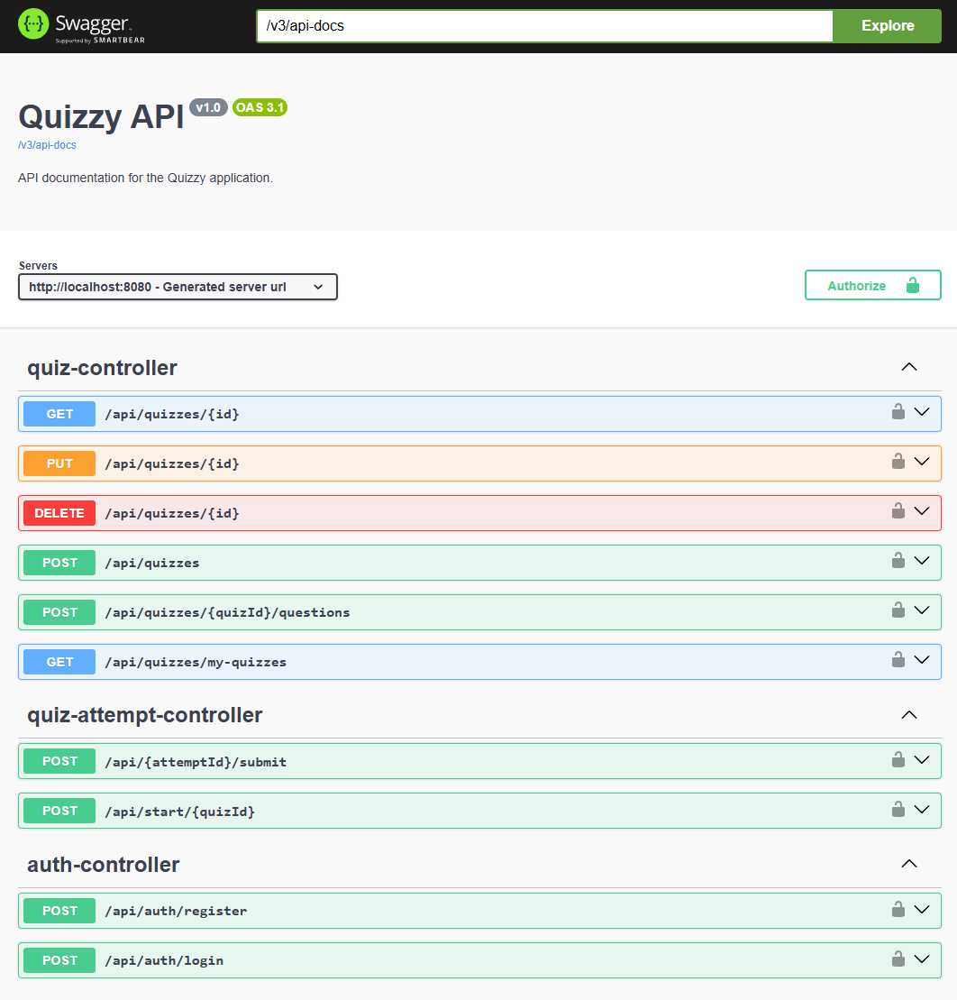
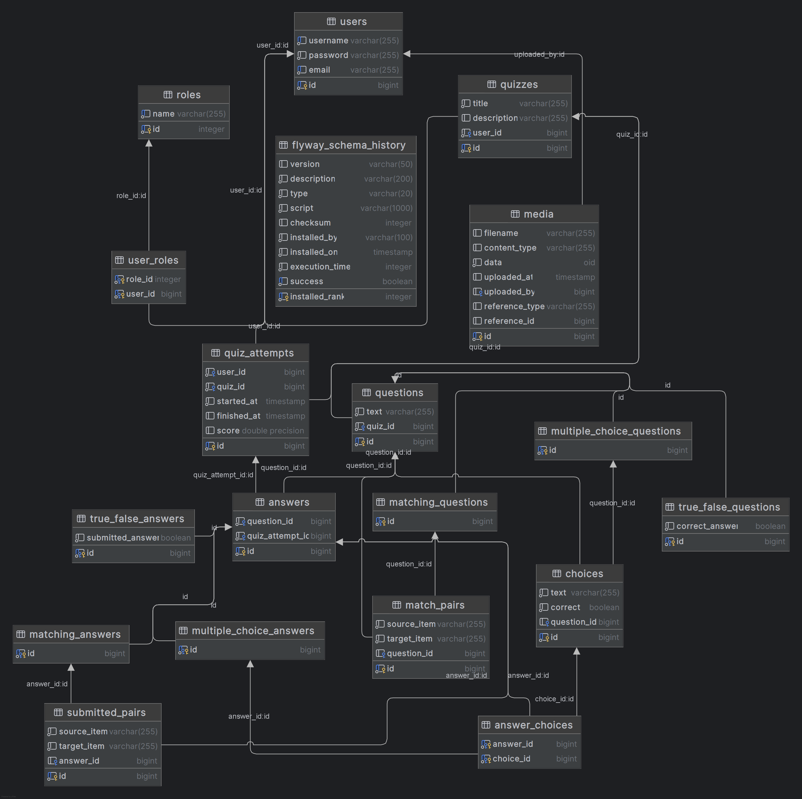
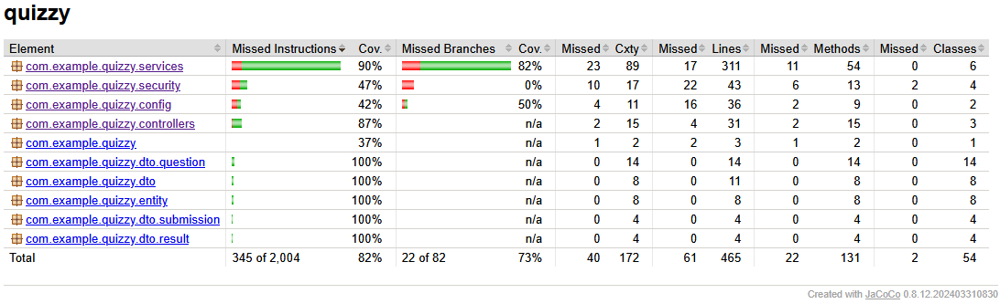

# Quizzy

Quizzy is a backend application built with Spring Boot that allows users to create, manage, and take quizzes. 
The application provides a REST API to handle all the business logic, including user authentication using JWT.

## Features

  * **User Authentication**: Secure user registration and login based on JSON Web Tokens (JWT).
  * **Quiz Creation**: Ability to add new quizzes and modify existing ones.
  * **Answering Quizzes**: Users can submit their answers to questions within a quiz.
  * **API Documentation**: Built-in Swagger UI documentation for easy endpoint testing and exploration. Available at `/swagger-ui/index.html`.

## Technological Stack

  * **Backend**:
      * Java 17
      * Spring Boot 2.6.4
      * Spring Web - For building web applications and RESTful APIs.
      * Spring Data JPA - For database persistence.
      * Spring Security - For handling authentication and authorization.
  * **Databases**:
      * PostgreSQL - Database for the production environment.
  * **Tools**:
      * Maven - For dependency management and project builds.
      * Docker - For application containerization.
      * Lombok - To reduce boilerplate code in Java.
      * MapStruct - For automatic object mapping (e.g., DTO to Entity).
      * Java JWT (jjwt) - For JSON Web Token implementation.
      * Springdoc OpenAPI - For automatic generation of API documentation in OpenAPI 3 format (Swagger UI).

## Prerequisites

Before running the project, make sure you have met the following requirements:

  * JDK 17
  * Apache Maven
  * Docker (optional, for running in a container)

## Installation and Running

### 0\. Before building the app

The app requires the following environmental variables to be set in a .env file within the main directory:

```env
ADMIN_USER=quizzy_admin
ADMIN_MAIL=quizzy_admin@quizzy.com
ADMIN_PASSWORD=quizzy_admin_password
POSTGRES_DB=db_name
POSTGRES_USER=db_user
POSTGRES_PASSWORD=db_password
JWT_SECRET="secure_key"
```

### 1\. Running with Maven

1.  **Clone the repository:**

    ```sh
    git clone https://github.com/michalkowal66/quizzy.git
    cd quizzy
    ```

2.  **Build the project:**

    ```sh
    mvn clean install
    ```

3.  **Run the application:**

    ```sh
    mvn spring-boot:run
    ```

    The application will be available at `http://localhost:8080`.

### 2\. Running with Docker

1.  **Clone the repository (if you haven't already):**

    ```sh
    git clone https://github.com/michalkowal66/quizzy.git
    cd quizzy
    ```

2.  **Build the application:**

    ```sh
    mvn clean install
    ```

3.  **Run the Docker container:**

    ```sh
    docker compose up
    ```

    This will run the application in a container.
    
    By default, the application will be available at `http://localhost:8080`.


## Swagger

To facilitate working with API Swagger endpoints were configured and exposed.
Swagger UI is available at:

`http://localhost:8080/swagger-ui/index.html`



## ER Diagram



## Testing

To run the tests execute the following command:

```bash
mvn test
```

Once the tests are completed a coverage report is generated.


