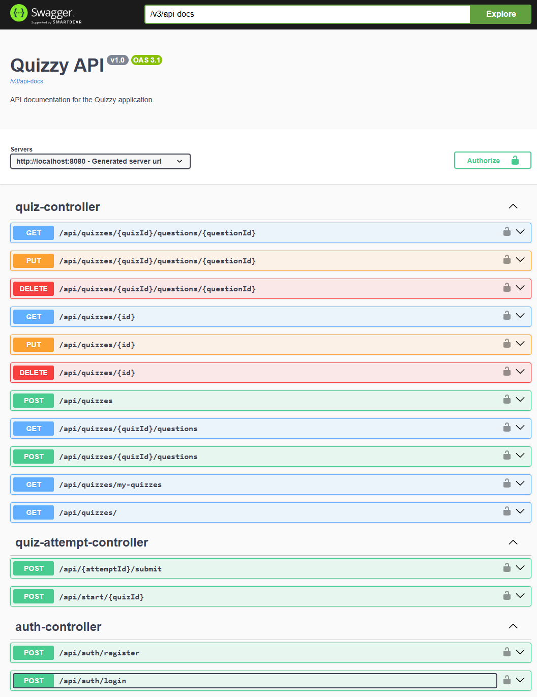

# Quizzy

Quizzy is a backend application built with Spring Boot that allows users to create, manage, and take quizzes. 
The application provides a REST API to handle all the business logic, including user authentication using JWT.

## Features

  * **User Authentication**: Secure user registration and login based on JSON Web Tokens (JWT).
  * **Quiz Creation**: Ability to add new quizzes and modify existing ones.
  * **Answering Quizzes**: Users can submit their answers to questions within a quiz.
  * **API Documentation**: Built-in Swagger UI documentation for easy endpoint testing and exploration. Available at `/swagger-ui/index.html`.

## Technological Stack

  * **Backend**:
      * Java 21
      * Spring Boot 3.4.4
      * Spring Web - For building web applications and RESTful APIs.
      * Spring Data JPA - For database persistence.
      * Spring Security - For handling authentication and authorization.
  * **Databases**:
      * PostgreSQL - Database for the production environment.
  * **Tools**:
      * Maven - For dependency management and project builds.
      * Docker - For application containerization.
      * Lombok - To reduce boilerplate code in Java.
      * Jackson - For JSON serialization and deserialization.
      * Java JWT (jjwt) - For JSON Web Token implementation.
      * Springdoc OpenAPI - For automatic generation of API documentation in OpenAPI 3 format (Swagger UI).

## Prerequisites

Before running the project, make sure you have met the following requirements:

  * JDK 17
  * Apache Maven
  * Docker (optional, for running in a container)

## Installation and Running

### 0\. Before building the app

The app requires the following environmental variables to be set in a .env file within the root directory of the repository:

```env
ADMIN_USER=quizzy_admin
ADMIN_MAIL=quizzy_admin@quizzy.com
ADMIN_PASSWORD=quizzy_admin_password
POSTGRES_DB=db_name
POSTGRES_USER=db_user
POSTGRES_PASSWORD=db_password
JWT_SECRET="secure_key"
```

### 1\. Running with Maven

1.  **Clone the repository:**

    ```sh
    git clone https://github.com/michalkowal66/quizzy.git
    cd quizzy
    ```

2.  **Build the project:**

    ```sh
    mvn clean install
    ```

3.  **Run the application:**

    ```sh
    mvn spring-boot:run
    ```

    The application will be available at `http://localhost:8080`.

### 2\. Running with Docker

1.  **Clone the repository (if you haven't already):**

    ```sh
    git clone https://github.com/michalkowal66/quizzy.git
    cd quizzy
    ```

2.  **Build the application:**

    ```sh
    mvn clean install
    ```

3.  **Run the Docker container:**

    ```sh
    docker compose up
    ```

    This will run the application in a container.
    
    By default, the application will be available at `http://localhost:8080`.


## Usage Guide

This section covers basic interaction with the API. 

**Remember: Most endpoints require authentication token to work.**

---

### 1. Create a Quiz

To create a new quiz, send a `POST` request to the `/api/quizzes` endpoint.

**Endpoint:**
```http
POST /api/quizzes
```

**Request Body:**

Provide a title and a description for your quiz.

```json
{
  "title": "My simple quiz",
  "description": "This is a very simple quiz"
}
```

**Successful Response:**

The response will contain the quiz information and a unique `id`

```json
{
  "id": 2,
  "title": "My simple quiz",
  "description": "This is a very simple quiz",
  "authorUsername": "test"
}
```

---

### 2. Add Questions to a Quiz

You can add different types of questions to an existing quiz using its `quizId`.

**Endpoint:**
```http
POST /api/quizzes/{quizId}/questions
```

#### Question Types

#### a) True/False

For a true or false question, specify the question text and the correct boolean answer.

**Request Body:**
```json
{
  "questionType": "TRUE_FALSE",
  "text": "Is the capital of Poland Warsaw?",
  "correctAnswer": true
}
```

#### b) Multiple Choice

For a multiple-choice question, provide the text and a list of choices. Each choice should have its text and a boolean indicating if it's a correct answer.

**Request Body:**
```json
{
  "questionType": "MULTIPLE_CHOICE",
  "text": "Which of the following are primitive types in Java?",
  "choices": [
    { "text": "String", "correct": false },
    { "text": "int", "correct": true },
    { "text": "ArrayList", "correct": false },
    { "text": "boolean", "correct": true }
  ]
}
```

#### c) Matching

For a matching question, provide the instructional text and a list of correct pairs.

**Request Body:**
```json
{
  "questionType": "MATCHING",
  "text": "Match the country to its capital.",
  "pairs": [
    { "sourceItem": "Germany", "targetItem": "Berlin" },
    { "sourceItem": "France", "targetItem": "Paris" },
    { "sourceItem": "Spain", "targetItem": "Madrid" }
  ]
}
```

---

### 3. Start a Quiz Attempt

To begin a quiz, send a `POST` request with the `quizId`. This will generate a unique `attemptId`.

**Endpoint:**
```http
POST /api/start/{quizId}
```

**Successful Response:**

The response will contain the `attemptId` and a list of questions for the quiz. Note that answer-related fields are omitted.

```json
{
  "attemptId": 2,
  "questions": [
    {
      "questionType": "TRUE_FALSE",
      "id": 4,
      "text": "Is the capital of Poland Warsaw?"
    },
    {
      "questionType": "MULTIPLE_CHOICE",
      "id": 5,
      "text": "Which of the following are primitive types in Java?",
      "choices": [
        { "id": 13, "text": "String" },
        { "id": 14, "text": "int" },
        { "id": 15, "text": "ArrayList" },
        { "id": 16, "text": "boolean" }
      ]
    },
    {
      "questionType": "MATCHING",
      "id": 6,
      "text": "Match the country to its capital.",
      "sourceItems": ["Germany", "France", "Spain"],
      "targetItems": ["Berlin", "Madrid", "Paris"]
    }
  ]
}
```

---

### 4. Submit Answers

Once the user has completed the quiz, submit their answers using the `attemptId`.

**Endpoint:**
```http
POST /api/{attemptId}/submit
```

**Request Body:**

The body should contain a list of answers, each corresponding to a question's type and ID.

```json
{
  "answers": [
    {
      "questionType": "TRUE_FALSE",
      "questionId": 4,
      "submittedAnswer": true
    },
    {
      "questionType": "MULTIPLE_CHOICE",
      "questionId": 5,
      "selectedChoiceIds": [14, 16]
    },
    {
      "questionType": "MATCHING",
      "questionId": 6,
      "submittedPairs": {
        "Germany": "Berlin",
        "France": "Madrid",
        "Spain": "Paris"
      }
    }
  ]
}
```

**Successful Response (Graded Results):**

The API will respond with the final score and a detailed breakdown of the submitted answers compared to the correct ones.

```json
{
  "attemptId": 2,
  "quizTitle": "My simple quiz",
  "totalQuestions": 3,
  "correctAnswersCount": 2,
  "score": 66.66666666666666,
  "gradedQuestions": [
    {
      "questionType": "TRUE_FALSE",
      "questionId": 4,
      "text": "Is the capital of Poland Warsaw?",
      "correct": true,
      "submittedAnswer": true,
      "correctAnswer": true
    },
    {
      "questionType": "MULTIPLE_CHOICE",
      "questionId": 5,
      "text": "Which of the following are primitive types in Java?",
      "correct": true,
      "submittedChoices": ["boolean", "int"],
      "correctChoices": ["boolean", "int"]
    },
    {
      "questionType": "MATCHING",
      "questionId": 6,
      "text": "Match the country to its capital.",
      "correct": false,
      "submittedPairs": {
        "Germany": "Berlin",
        "France": "Madrid",
        "Spain": "Paris"
      },
      "correctPairs": {
        "France": "Paris",
        "Germany": "Berlin",
        "Spain": "Madrid"
      }
    }
  ]
}
```


## Swagger

To facilitate working with API Swagger endpoints were configured and exposed.
Swagger UI is available at:

`http://localhost:8080/swagger-ui/index.html`



It can be used to make API calls, find endpoints and understand them, and lookup DTOs.

## ER Diagram


## Testing

To run the tests execute the following command:

```bash
mvn test
```

Once the tests are completed a coverage report is generated.


